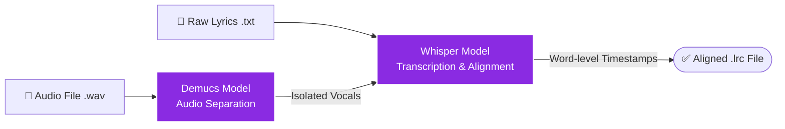

# 🎛️ Lyrics Align & Manager

A suite of Python automation scripts designed to process, clean, and synchronize local `.lrc` lyrics files directly into a MongoDB cloud database for custom Spotify players.

## 📖 Overview



When building a custom lyrics database, developers often face a classic issue: **Operating System filename limitations vs. Official API metadata**. 
For instance, Windows forbids characters like `?` and `:` in filenames, forcing users to save files with full-width characters (e.g., `BURN：BORN`, `Dou-Da？ DOING!`). However, official APIs (like iTunes or Spotify) use standard half-width characters (`BURN:BORN`). This discrepancy causes standard database lookups to fail.

`lyrics-align` solves this problem elegantly by utilizing Regular Expression wildcards to bridge the gap between local filesystem constraints and database exact-matches, ensuring a 100% sync rate without requiring manual file renaming.

## ✨ Features

* **Regex Wildcard Matching (`fast_update.py`)**: Automatically converts tricky punctuations, whitespaces, and full-width symbols into regex wildcards (`.*`). This allows the script to confidently match local files to database records despite naming inconsistencies.
* **Batch Processing**: Scans local directories for new or updated `.lrc` files and seamlessly injects the content into existing MongoDB documents.
* **Automated Database Setup (`fix_lyrics_names.py`)**: Handles the initial sanitization and generation of database records based on third-party API scraped data.

## 🛠️ Prerequisites

* Python 3.8+
* MongoDB Database (Atlas or local)
* Required Python packages:
  ```bash
  pip install pymongo python-dotenv
  ```

## Quick Start
1. Clone the repository:
```bash
git clone [https://github.com/yourusername/lyrics-align.git](https://github.com/yourusername/lyrics-align.git)
cd lyrics-align
```

2. Environment Setup:
Create a .env file in the root directory and add your MongoDB connection string:
```
MONGO_URI=mongodb+srv://<username>:<password>@cluster.mongodb.net/?retryWrites=true&w=majority
```

3. Prepare Lyrics Files:
Place your downloaded or formatted .lrc files into the ./downloads directory.

Run the Sync Script:

```bash
python fast_update.py
```

4. Review Output:
The terminal will provide a detailed log indicating successful seamless updates, files skipped due to missing initial database records, or warnings for multiple fuzzy matches requiring manual review.

📂 Project Structure
fast_update.py: Core synchronization script utilizing Regex fuzzy matching.

fix_lyrics_names.py: Initial database seeding and sanitization script.

downloader.py: Downloads .wav audio files from YouTube based on urls.txt.

editor.py: Utility tools for direct database management.

lyrics_scraper.py: Scrapes raw text lyrics from https://www.uta-net.com/.

add_intro_notes.py: Automatically injects intro metadata for compatible tracks.

/downloads/: Target directory for audio processing and local .lrc storage.

/separated_vocals/: Cache directory for Demucs vocal stems to speed up re-alignments.
