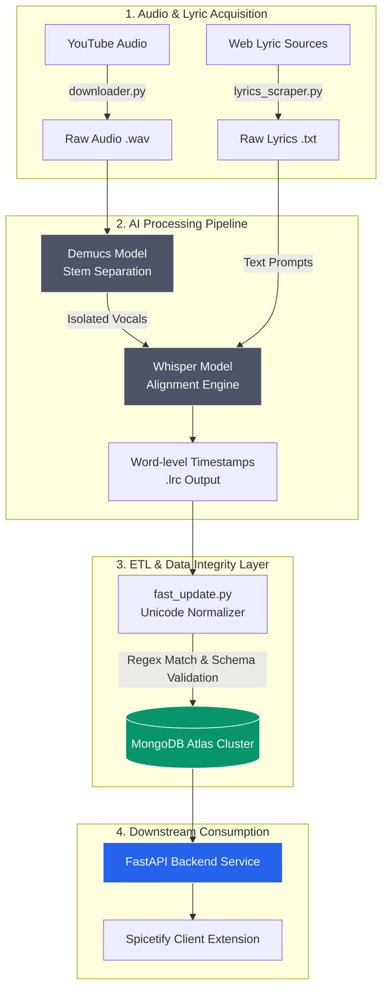

# AutoLRC: Audio Alignment & Ingestion Pipeline

An automated data pipeline and backbone service designed to orchestrate audio source separation, word-level lyric alignment, and robust metadata ingestion for client-side synchronized playback.

---

## 🏗️ System Architecture



---

---

---

## 🔐 Environment Setup

This pipeline uses a **Bring Your Own Database (BYOD)** approach. You must configure your own MongoDB instance to store the generated `.lrc` metadata.

1. Create a `.env` file in the root directory.
2. Add your MongoDB connection URI:
   ```env
   MONGO_URI=mongodb+srv://<your_username>:<your_password>@cluster.mongodb.net/?retryWrites=true&w=majority
   ```
*(Note: Do not commit your `.env` file to version control. It is already included in the `.gitignore`.)*


## 🚀 Data Ingestion Workflow

This repository utilizes a modular, step-by-step pipeline to process audio and lyrics. To ingest new tracks:

1. **Audio Acquisition:**
   Add target YouTube links to `urls.txt`. Run the downloader to fetch `.wav` files into the `./downloads/` directory (you will need to create this directory if it doesn't exist).
   ```bash
   python downloader.py
   ```

2. **Lyrics Scraping (Interactive):**
   Fetch raw lyric `.txt` files based on song titles. This script includes an interactive prompt in the terminal to ensure accurate lyric mapping.
   ```bash
   python lyrics_scraper.py
   ```

3. **AI Alignment (The Core Engine):**
   Execute the main alignment logic. This script runs Demucs (for vocal isolation) and Whisper (for timestamping) on the files in `./downloads/`, outputting the perfectly aligned `.lrc` files.
   ```bash
   python aligner.py
   ```

4. **Intro Adjustment (Optional):**
   If the track has a long instrumental intro, run this utility to inject introductory timing offsets and metadata.
   ```bash
   python add_intro_notes.py
   ```

5. **Database Ingestion:**
   Sync the generated `.lrc` files to your MongoDB cluster. The script handles regex fuzzy matching for any local vs. database naming discrepancies.
   ```bash
   python fast_update.py
   ```

---

## 📂 Repository Structure

| File / Directory | Description |
| :--- | :--- |
| `aligner.py` | **Core Engine:** Orchestrates Demucs and Whisper for `.wav` to `.lrc` alignment. |
| `fast_update.py` | ETL script handling local `.lrc` parsing, regex fuzzy matching, and MongoDB updates. |
| `downloader.py` | Audio acquisition script that reads from `urls.txt`. |
| `lyrics_scraper.py` | Interactive scraper for extracting structured lyric text from web sources. |
| `add_intro_notes.py` | Utility to inject introductory timing offsets for specific tracks. |
| `fix_lyrics_names.py` | Database seeding and track title sanitization utility. |
| `editor.py` | Database inspection and remote document management interface. |
| `urls.txt` | Target list of YouTube URLs for audio acquisition. |
| `/downloads/` | *(User-created)* Working directory for incoming audio, raw text, and `.lrc` outputs. |
| `/separated_vocals/` | *(Auto-generated)* Cache storage for Demucs vocal audio stems. |

## 🛠️ Tech Stack & Dependencies

* **Language & Runtime:** Python 3.8+
* **ML / Audio Models:** PyTorch, Demucs (Audio Source Separation), OpenAI Whisper (ASR / Timestamp Alignment)
* **Database & Drivers:** MongoDB Atlas, PyMongo
* **Environment Configuration:** python-dotenv