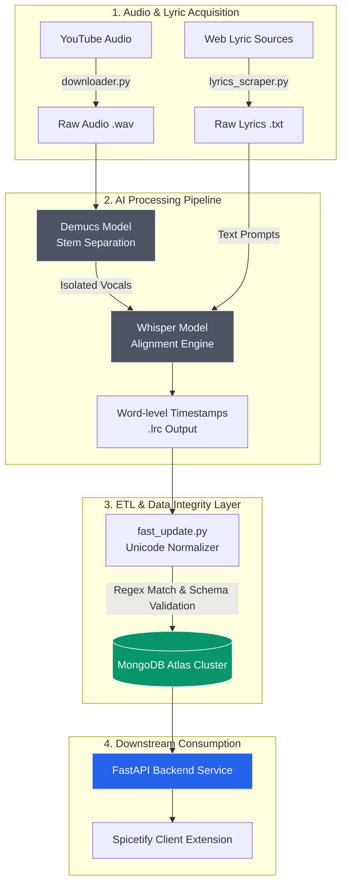

# AutoLRC: Audio Alignment & Ingestion Pipeline

An automated data pipeline and backbone service designed to orchestrate audio source separation, word-level lyric alignment, and robust metadata ingestion for client-side synchronized playback.

---

## 🏗️ System Architecture

---

## ⚙️ Core Pipeline Components

### 1. Audio Separation & Transcription Engine
* **Vocal Isolation (Demucs):** Extracts clean vocal stems from raw audio, eliminating instrumental interference to improve transcription accuracy.
* **Cached Stem Storage (`/separated_vocals/`):** Persists processed audio stems locally to accelerate subsequent alignment iterations and minimize redundant GPU computation.
* **Word-Level Alignment (Whisper):** Combines isolated vocals with reference lyrics to generate high-precision timestamps in `.lrc` format.

### 2. ETL & Metadata Normalization (`fast_update.py`, `fix_lyrics_names.py`)
* **Unicode & Full-Width Sanitization:** Automatically normalizes encoding discrepancies (such as full-width vs. half-width symbols and OS-restricted characters) between local file naming conventions and streaming metadata.
* **Regex-Based Record Matching:** Resolves edge-case naming mismatches through dynamic pattern matching, ensuring reliable database updates without manual intervention.

---

## 📂 Repository Structure

| File / Directory | Description |
| :--- | :--- |
| `fast_update.py` | Core ETL script handling local `.lrc` parsing, fuzzy matching, and MongoDB updates. |
| `fix_lyrics_names.py` | Database seeding and track title sanitization utility. |
| `downloader.py` | Audio acquisition script for target source tracks. |
| `lyrics_scraper.py` | Automated scraper for structured lyric text extraction. |
| `editor.py` | Database inspection and document management interface. |
| `add_intro_notes.py` | Utility to inject introductory timing offsets and metadata into track records. |
| `/downloads/` | Working directory for incoming audio files and generated `.lrc` outputs. |
| `/separated_vocals/` | Cache storage for separated vocal audio stems. |

---

## 🛠️ Tech Stack & Dependencies

* **Language & Runtime:** Python 3.8+
* **ML / Audio Models:** PyTorch, Demucs (Audio Source Separation), OpenAI Whisper (ASR / Timestamp Alignment)
* **Database & Drivers:** MongoDB Atlas, PyMongo
* **Environment Configuration:** python-dotenv